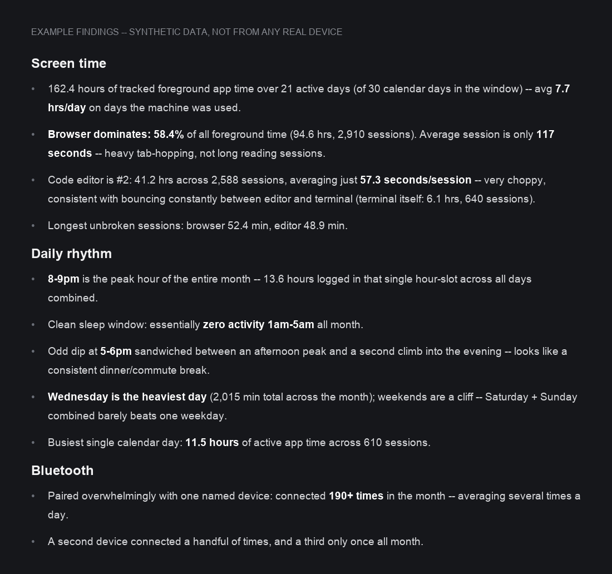

# knowledgec-privacy-audit

**Your Mac has been keeping a diary on you. You were never asked, you can't read it without
special permission, and it's already been copied to your other Apple devices.**

[](LICENSE)
[](#requirements)
[](#requirements)
[](knowledgec_audit.py)

Every Mac silently logs, at multi-second resolution, which apps you use, which Bluetooth
devices you connect to (cars, headphones), and when. It's stored in a file macOS won't let
even you open without an extra permission grant, and a copy already syncs to your other
Apple devices over iCloud. This is a single, dependency-free Python script that shows you
exactly what's in it, on your own machine, and lets you clear it.

```bash
git clone https://github.com/jsawyerdev/knowledgec-privacy-audit
cd knowledgec-privacy-audit
python3 knowledgec_audit.py report
```

That's it. No install step, no third-party packages, nothing leaves your machine.

## What macOS is actually logging

The file lives at `~/Library/Application Support/Knowledge/knowledgeC.db`, written
continuously by an Apple system daemon (part of the CoreDuet / "Knowledge" framework). It
records, at minimum:

- **Every app you bring to the foreground** — start and end timestamps down to the session.
  Not "used Chrome today": individual multi-second bursts, thousands of them a month.
- **Every Bluetooth device you connect to**, by name, with a timestamp per connection. On a
  laptop that pairs with a car's hands-free system, that's a timestamped log of when you got
  in the car.
- **Notification delivery events.**
- **Search/Siri/Spotlight activity signals.**
- **A sync table (`ZSYNCPEER`)** that replicates a subset of this data to your other Apple
  devices signed into the same iCloud account, over the same Rapport/Continuity protocol
  Handoff uses. Running this tool on one Mac can surface device identifiers and models for
  iPhones and iPads that have nothing to do with that Mac.

## Why you've probably never seen this

macOS gates the file behind Full Disk Access — a permission prompt you have to grant
explicitly, even to read your own data as the machine's owner. Most people never do, so most
people don't know this exists.

It isn't hypothetical exposure, either. This exact file is a well-documented target in
mobile/desktop forensics tooling — Sarah Edwards' APOLLO project, and commercial extraction
suites like Cellebrite and Magnet AXIOM, parse it specifically because of how much
"pattern of life" data it holds.

To be precise about the claim: this project makes no assertion that Apple transmits the raw
file off your devices, and I have no evidence either way on that. What's demonstrable — and
what this tool shows directly from your own database — is that the data exists in far more
detail than most people expect, that it already replicates across your own devices without a
prompt, and that anyone who gets Full Disk Access to one of your Macs, physically, via remote
management, or via forensic tooling, gets a timestamped activity log most people believe
doesn't exist.

## What's in the box

One file, `knowledgec_audit.py`, two subcommands:

| Command | Effect |
|---|---|
| `report` | Read-only. Prints top apps, activity by hour/day, Bluetooth pairings, notification senders, and which other devices this data has synced with. |
| `purge` | Deletes existing rows, with a confirmation prompt. |

No third-party packages, nothing phones home, nothing writes anywhere except the database
file itself, and only when you explicitly run `purge`. Read the script — every query in it is
named for what it does.

## Requirements

- macOS (this file doesn't exist on other platforms).
- Python 3.10 or newer (`python3 --version`; macOS ships one).
- Full Disk Access granted to whatever will run the script.

## Granting Full Disk Access

macOS will refuse to open the database ("authorization denied") until you do this, even
though it's your own file and your own user account:

1. Open System Settings -> Privacy & Security -> Full Disk Access.
2. Click `+` and add the application you'll run this from (Terminal.app, iTerm, VS Code, etc.).
3. Turn the toggle on.
4. Fully quit (Cmd+Q) and reopen that application. A window restart is not enough — TCC
   checks at process launch.

## Usage

```bash
python3 knowledgec_audit.py report
python3 knowledgec_audit.py report --top 25
python3 knowledgec_audit.py purge --keep-days 0        # asks for confirmation
python3 knowledgec_audit.py purge --keep-days 7 --yes  # keep last week, no prompt
python3 knowledgec_audit.py --db-path /path/to/copy.db report   # test against a copy
```

`report` never writes to the database (opens it `mode=ro`). `purge` opens it read-write and
asks for a `y` confirmation before deleting anything unless you pass `--yes`.

### Example findings

Every value below is fabricated by [assets/generate_example_report.py](assets/generate_example_report.py)
-- none of it is pulled from a real machine. This is the shape and scale of
what `report` actually surfaces, not a hypothetical:



<details>
<summary>Raw terminal output shape</summary>

```
Retention: 19 day(s) of app-usage history on disk right now
  2026-01-04 .. 2026-01-23
  8,214 rows present / 164,902 ever recorded (macOS deletes the rest on its
  own rolling schedule -- you were never asked)

Top 5 applications by tracked time:
bundle id              time     sessions
---------------------  -------  --------
com.google.Chrome      94h36m   2910
com.microsoft.VSCode   41h12m   2588
...

Bluetooth devices this Mac has connected to:
device               connect events  first seen  last seen
-------------------  --------------  ----------  ----------
<car head unit>       190            2026-01-05  2026-01-22

This data has synced with 2 other Apple device(s) via iCloud/Continuity:
device id                              model        last seen
--------------------------------------  -----------  ----------
7F2A9C01-...                            iPhone14,4   2026-01-15
B3E8D420-...                            iPad5,1      2026-01-15
```

</details>

## Important limitations

- **Purging does not stop future logging.** The daemon that owns this file restarts logging
  within seconds of a purge. To reduce what gets collected going forward, use:
  - System Settings -> Siri & Spotlight -> turn off "Learn from this Mac".
  - System Settings -> Screen Time -> turn it off.
  - Neither of these fully stops the lower-level Bluetooth/notification streams; there is no
    user-facing toggle for those as of this writing.
- **The schema varies by macOS version.** `ZSTRUCTUREDMETADATA` has roughly 190 sparse
  columns across every Apple subsystem that has ever logged into Knowledge; this tool checks
  for the columns/tables it needs and silently skips a section if your macOS version doesn't
  have it, rather than crashing.
- **This does not cover iOS/iPadOS.** Those devices sandbox this file differently; this tool
  only reads a local macOS copy.
- **Be careful sharing `report` output.** It contains real device names (your car's Bluetooth
  name, your headphones), device identifiers for your other Apple hardware, and enough timing
  detail to reconstruct your daily schedule. Redact before pasting it anywhere public.

## Why publish this

I found this by accident while poking at my own Mac and was surprised by how much detail
this file holds, and that it was already syncing across devices I own without any indication
it was happening. Publishing the tool that found it seemed more useful than a blog post: run
it on your own machine, look at your own data, decide for yourself whether you're comfortable
with it.

## Contributing

Pull requests that add support for additional `ZSTREAMNAME` values or `ZSTRUCTUREDMETADATA`
columns seen on other macOS versions are especially welcome — open an issue with the output
of:

```bash
sqlite3 ~/Library/Application\ Support/Knowledge/knowledgeC.db \
  "SELECT ZSTREAMNAME, COUNT(*) FROM ZOBJECT GROUP BY ZSTREAMNAME;"
```

## License

MIT. See [LICENSE](LICENSE). Maintained by jsdev.
